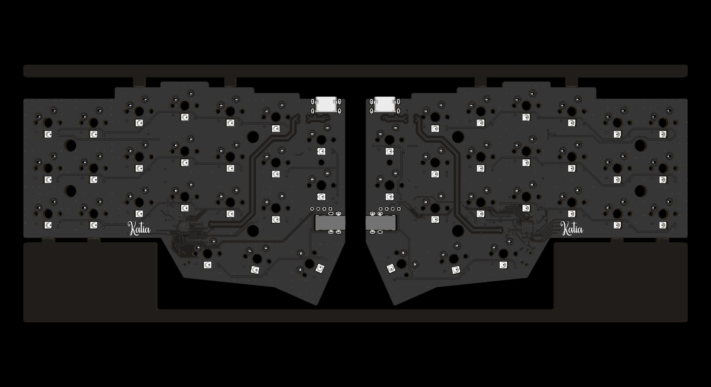
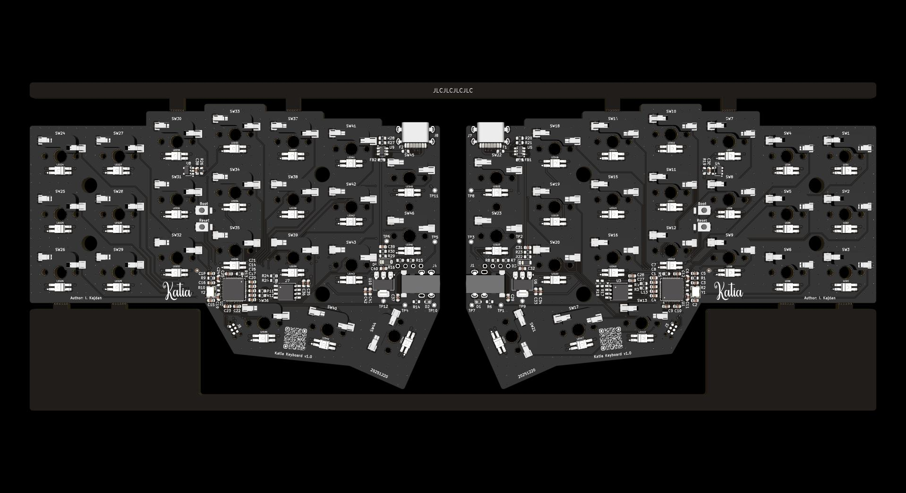

  
  
  
  
  

 

<h1 align="center">
  
    
  Katia Keyboard
    
</h1>

  <a href="#hardware">Hardware</a> •
  <a href="#firmware">Firmware</a> •
  <a href="#license">License</a>

Katia is a split mechanical keyboard with 6 by 3 column staggered keys and 3 thumb keys, based on the Crkbrd design.

Compared to the original Crkbrd, Katia features 4-layer PCB stackup, which allows for better routing and thus, better signal integrity.

The design is intended to be used with hot-swap sockets for Cherry MX switches. The switches are backlit with individually addressable WS2812B LEDs.

All the mechanical components are kept in the same position as in the original project. This allows for easy replacement of the PCB in existing Crkbrd cases, or to use the existing Crkbrd cases and plates with the new PCB.

## Hardware

> [!WARNING]
> Do not plug in or unplug the interconnect jack between the two keyboard halves while the keyboard is powered. Hot-plugging can cause electrical damage to the PCB and components. Always disconnect power before handling the communication cable.

The PCB stackup consists of four layers.

| Top View                          | Bottom View                       |
|-----------------------------------|-----------------------------------|
|      |  |

## License

This project is licensed under the [CERN Open Hardware Licence Version 2 - Permissive](https://ohwr.org/cern_ohl_p_v2.txt).
You are free to use, modify, and distribute this design, provided you retain notices and disclaimers as specified in the license terms. See the [LICENSE](LICENSE.md) file for details.
